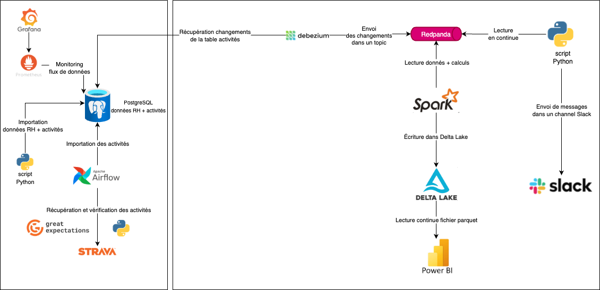
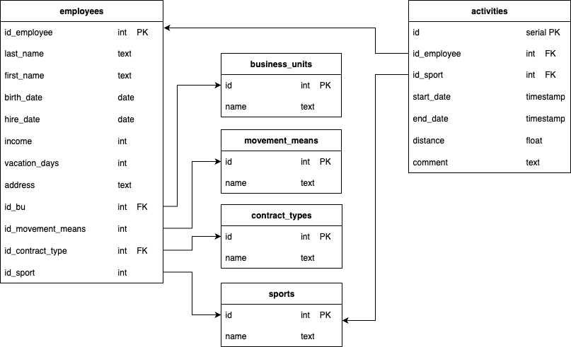

# Rewards solution

Ce projet implémente une solution proposant des avantages à l’ensemble des collaborateurs s'ils pratiquent une activité physique de manière  régulière.

## Architecture



## Schéma de données




## Prérequis

- docker
- docker-compose
- bucket AWS S3
- Tableau

## Structure principale du projet

```
├── config/                  # Dossier regroupant les fichiers de configuration des services
├── docker-compose.yml       # Fichier yaml spécifiant les services
├── results.pdf              # Résultats d'analyse
├── scripts/                 # Dossier regroupant les scripts utilisés par les services
```

## Installation

1. **Cloner le dépôt**

```bash
git clone https://github.com/nau81000/rewards.git
cd rewards
```

2. **Définir les variables d'environnement**

```bash
# Copier le template et éditer le fichier .env
cp .env.template .env
```

| Variable | Description |
| -------- | -------     |
| _PIP_ADDITIONAL_REQUIREMENTS | packages additionnels utilisés dans Airflow |
| AIRFLOW_DAG_PACKAGE | Nom donnée au DAG Airflow  |
| AIRFLOW_UID | UID de l'utilisateur utilisé par Airflow
| AWS_ACCESS_KEY_ID | ACCESS_KEY_ID pour accéder au dossier S3 d'Amazon |
| AWS_SECRET_ACCESS_KEY | SECRET_ACCESS_KEY pour accéder au dossier S3 d'Amazon |
| AWS_S3_BUCKET_NAME | Nom du dossier S3 d'Amazon | 
| AWS_S3_ROOT_STORAGE | URL du dossier S3 d'Amazon utilisée par l'application Spark | 
| DREMIO_PASSWORD | Mot de passe de l'administrateur Dremio |
| DREMIO_SOURCE_NAME | Nom donné à la source Sport Data sous Dremio |
| DREMIO_USERNAME | Nom d'utilisateur de l'administrateur Dremio |
| GOOGLE_MAPS_API_KEY | Clé d'accès à l'API Google Maps |
| POSTGRES_ADMIN_PWD | Mot de passe de l'administrateur Postgres |
| POSTGRES_ADMIN_USER | Nom d'utilisateur de l'administrateur Postgres |
| POSTGRES_DB_HOST | Nom d'hôte de la base Postgres |
| POSTGRES_DB_NAME | Nom de la base Postgres |
| POSTGRES_SQL_ALCHEMY_CONN | URL de connection à la base Postgres pour SQLAlchemy |
| REWARDS_EXTRA_DAYS | Nombre de jours gagnés quand l'employé a une activité sportive régulière |
| REWARDS_INCOME_PERCENT | Pourcentage du salaire gagné quand l'employé vient au bureau en mobilité douce |
| REWARDS_MAX_HOME_DISTANCE_WALK | Distance domicile-bureau maximale de l'employé s'il vient en marchant/courant |
| REWARDS_MAX_HOME_DISTANCE_OTHER  | Distance domicile-bureau maximale de l'employé s'il vient à vélo/trotinette |
| REWARDS_MIN_ACTIVITIES_YEAR | Nombre minimal d'activités sportives que l'employé doit pratiquer dans l'année pour gagner des jours |
| REWARDS_OFFICE_ADDRESS | Adresse du bureau | 
| SLACK_TOKEN | Token pour se connecter au channel Slack |
| SLACK_CHANNEL | Channel Slack sur lequel les messages sont envoyés |
| SLACK_USERNAME | Nom d'utilisateur pour se connecter à Slack | 
| SRC_RH_DATA_FILE | Source des données RH |
| SRC_SPORTS_DATA_FILE | Source des données sportives des employés |


Exemple:

```
_PIP_ADDITIONAL_REQUIREMENTS=openpyxl great_expectations
AIRFLOW_DAG_PACKAGE=sport_data
AIRFLOW_UID=501
AWS_ACCESS_KEY_ID=***
AWS_SECRET_ACCESS_KEY=***
AWS_S3_BUCKET_NAME=nau-sport-data
AWS_S3_ROOT_STORAGE=s3a://$AWS_S3_BUCKET_NAME
DREMIO_PASSWORD=dremio01
DREMIO_SOURCE_NAME=sport-data
DREMIO_USERNAME=dremio
GOOGLE_MAPS_API_KEY=***
POSTGRES_ADMIN_PWD=sport_data
POSTGRES_ADMIN_USER=sport_data
POSTGRES_DB_HOST=sport-data-db
POSTGRES_DB_NAME=sport_data
POSTGRES_SQL_ALCHEMY_CONN=postgresql+psycopg2://$POSTGRES_ADMIN_USER:$POSTGRES_ADMIN_PWD@$POSTGRES_DB_HOST:5432/$POSTGRES_DB_NAME
REWARDS_EXTRA_DAYS=5
REWARDS_INCOME_PERCENT=5
REWARDS_MAX_HOME_DISTANCE_WALK=15
REWARDS_MAX_HOME_DISTANCE_OTHER=25
REWARDS_MIN_ACTIVITIES_YEAR=15
REWARDS_OFFICE_ADDRESS=1362 Av. des Platanes, 34970 Lattes
SLACK_TOKEN=***
SLACK_CHANNEL=activities
SLACK_USERNAME=python messenger
SRC_RH_DATA_FILE=https://s3.eu-west-1.amazonaws.com/course.oc-static.com/projects/922_Data+Engineer/1039_P12/Donne%CC%81es+RH.xlsx
SRC_SPORTS_DATA_FILE=https://s3.eu-west-1.amazonaws.com/course.oc-static.com/projects/922_Data+Engineer/1039_P12/Donne%CC%81es+Sportive.xlsx
```

Note:

Pour pouvoir envoyer des messages sur un canal Slack, vous devez créer une application Slack qui pourra se connecter sur votre profile Slack (préalablement créé). Vous obtiendrez un token qu'il faudra utiliser (SLACK_TOKEN).

## Structure principale du projet

```
├── docker-compose.yml             # Paramètrages des services
├── Docker.spark                   # Paramètrage de l'image utilisée par les service Spark
├── config/                        # Modules utilisés par les services
│   ├── dremio/                     
│       ├── init.sh                # Initialisation du service dremio
│   ├── grafana/                     
│       ├── datasource.yml         # Configuration du service Grafana
│   ├── prometheus/                     
│       ├── prometheus.yml         # Configuration du service Prometheus
├── docker/                        # Dossier dans lequel les données d'exécution des différents services sont placées
│   ├── airflow/                   # Dossier d'exécution d'Airflow
│   ├── debezium/                  # Dossier d'exécution de Debezium
│   ├── dremio/                    # Dossier d'exécution de Dremio
│       ├── tableau/               # Dossier dans lequel les fichiers de connection Tableau sont créés
├── scripts/                       # Modules utilisés par les services
│   ├── slack/                     
│       ├── redpanda_to_slack.py   # Consommateur topic Redpanda envoyant des messages sur Slack
│   ├── spark/                     
│       ├── activities.py          # Application Spark agrégeant les données pour l'analyse (Tableau)
│   ├── sport_data/                     
│       ├── functions.py           # Utilitaires
│       ├── init-db.py             # Initialisation données RH + activités
│       ├── sport_data.py          # DAG Airflow
│   ├── strava_like/                     
│       ├── server.py              # Serveur générateur d'activités
```

## Utilisation

Docker-compose permet de créer automatiquement l'environnement de travail: création et initialisation des bases de données, lancement des services.

- Construction de l'environnement avec la commande:

```
docker-compose up -d
```

- Destruction des containers de l'environnement avec la commande:

```
docker-compose down -v
```

- Destruction des volumes de l'environnement et de tous les volumes Docker inutilisés avec la commande: 

```
rm -rf docker && docker volume prune -f -a
```

