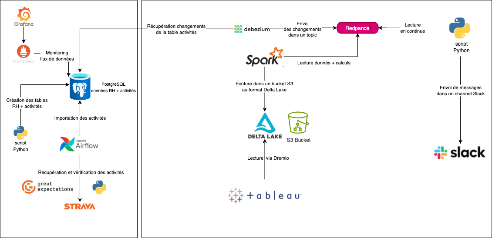

# Rewards solution

Ce projet implémente une solution proposant des avantages à l’ensemble des collaborateurs s'ils pratiquent une activité physique de manière  régulière.

## Architecture



## Prérequis

- docker
- docker-compose

## Installation

1. **Cloner le dépôt**

```bash
git clone https://github.com/nau81000/rewards.git
cd rewards
```

2. **Définir les variables d'environnement**

```bash
# Copier le template et éditer le fichier .env
cp .env.template .env
````
Exemple:

```
AIRFLOW_IMAGE_NAME=apache/airflow:2.10.0 
AIRFLOW_UID=501
AIRFLOW_PROJ_DIR=./docker/airflow
_PIP_ADDITIONAL_REQUIREMENTS=openpyxl great_expectations
DAG_PACKAGE=sport_data
POSTGRES_DB_HOST=sport-data-db
POSTGRES_DB_NAME=sport_data
POSTGRES_ADMIN_USER=sport_data
POSTGRES_ADMIN_PWD=sport_data
SPORT_DATA_SQL_ALCHEMY_CONN=postgresql+psycopg2://$POSTGRES_ADMIN_USER:$POSTGRES_ADMIN_PWD@$POSTGRES_DB_HOST/$POSTGRES_DB_NAME
RH_DATA_FILE=https://s3.eu-west-1.amazonaws.com/course.oc-static.com/projects/922_Data+Engineer/1039_P12/Donne%CC%81es+RH.xlsx
SPORTS_DATA_FILE=https://s3.eu-west-1.amazonaws.com/course.oc-static.com/projects/922_Data+Engineer/1039_P12/Donne%CC%81es+Sportive.xlsx
SLACK_TOKEN=xoxb-...
SLACK_CHANNEL=activities
SLACK_USERNAME=python messenger
```

Note:

Pour pouvoir envoyer des messages sur un canal Slack, vous devez créer une application Slack qui pourra se connecter sur votre profile Slack (préalablement créé). Vous obtiendrez un token qu'il faudra utiliser (SLACK_TOKEN).

## Structure du projet

```
├── docker-compose.yml             # Paramètrages des services
├── prometheus.yml                 # Configuration du service Prometheus
├── scripts/                       # Modules utilisés par les services
│   ├── slack/                     
│       ├── redpanda_to_slack.py   # Consommateur topic Redpanda vers Slack
│   ├── sport_data/                     
│       ├── functions.py           # Utilitaires
│       ├── init-db.py             # Initialisation données RH + activités
│       ├── sport_data.py          # DAG Airflow
│   ├── strava_like/                     
│       ├── server.py              # Serveur générateur d'activités
```

## Utilisation

Docker-compose permet de créer automatiquement l'environnement de travail: création et initialisation des bases de données, lancement des services.

- Construction de l'environnement avec la commande:

```
docker-compose up -d
```

- Destruction des containers de l'environnement avec la commande:

```
docker-compose down -v
```

- Destruction des volumes de l'environnement et de tous les volumes Docker inutilisés avec la commande: 

```
rm -rf <AIRFLOW_PROJ_DIR> && docker volume prune -f -a
```

